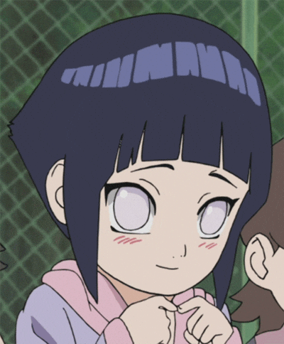
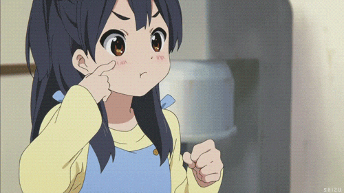
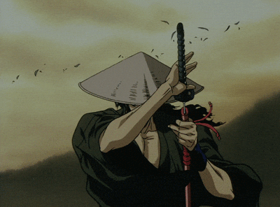
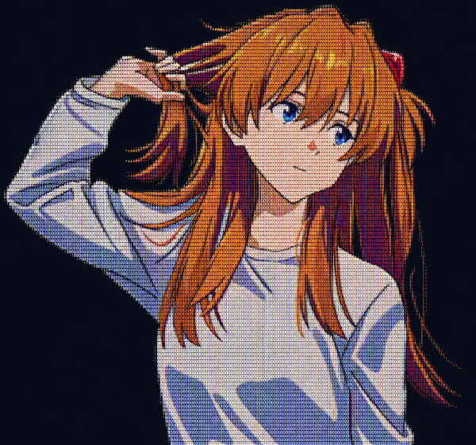
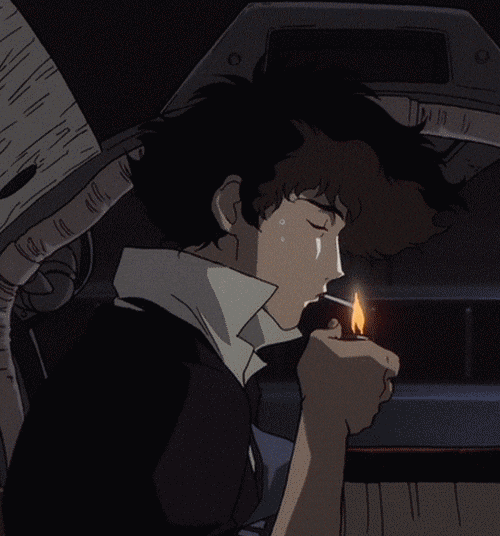

<div align="center">


<a href="https://github.com/Ridzkyan">
  
</a>

<br/>


&ensp;

&ensp;

&ensp;

&ensp;


<br/><br/>


&ensp;

&ensp;

&ensp;

&ensp;


<br/>


</div>

<br/>

<!-- ══════════════════════════════════════════════ -->
<!--                   ABOUT ME                   -->
<!-- ══════════════════════════════════════════════ -->

<table width="100%">
<tr>
<td width="60%" valign="top">

### ⚡ // ABOUT.ME

```ts
const ridzkyan = {
  name        : "Ridho Dzaky Raihan",
  alias       : "Ridzkyan",
  status      : "Mahasiswa Informatika",
  base        : "Indonesia 🇮🇩",
  age         : 21,
  pronouns    : "He / Him",
  timezone    : "Asia/Jakarta (UTC+7) 🕐",
  languages   : ["Bahasa Indonesia 🇮🇩", "English 🇬🇧"],

  stack: {
    frontend : ["React", "Next.js", "TypeScript"],
    backend  : ["Node.js", "Go", "Python", "PHP"],
    mobile   : ["Flutter", "Dart"],
    database : ["MySQL"],
  },

  interests    : ["Anime", "Coding", "Tech", "Gaming"],
  os           : "Windows + WSL (Linux)",
  editor       : "VS Code  ⚡",
  learning     : ["System Design", "DevOps", "Next.js 15"],
  openTo       : ["Internship", "Freelance", "Collab"],
  favAnime     : ["One Piece", "Naruto", "Demon Slayer"],
  workStyle    : "Night Owl 🦉 — best code at 2AM",
  currentFocus : "Kadang ngoding kadang tidur",
  funFact      : "Tidur jam 6 pagi bangun jam 6 sore",
  philosophy   : "Jika ada 99% yang gagal, berarti ada 1% yang berhasil",
};
```

<div align="left">
</div>

</td>
<td width="40%" align="center" valign="middle">


<br/><br/>


</td>
</tr>
</table>

<br/>

<!-- ══════════════════════════════════════════════ -->
<!--                  TECH STACK                  -->
<!-- ══════════════════════════════════════════════ -->

<div align="center">

### ⚡ // TECH.STACK

</div>

<table width="100%">
<tr>
<td width="50%" valign="top" align="center">

**🌐 Frontend & Framework**


<br/><br/>

**⚙️ Backend & Language**


</td>
<td width="50%" valign="top" align="center">

**📱 Mobile & Database**


<br/><br/>

**🔧 Tools & Platform**


</td>
</tr>
<tr>
<td width="50%" valign="top" align="center">
<br/>

</td>
<td width="50%" valign="top" align="center">
<br/>

</td>
</tr>
</table>

<br/>

<!-- ══════════════════════════════════════════════ -->
<!--               GITHUB STATS                   -->
<!-- ══════════════════════════════════════════════ -->

<div align="center">

### 📡 // GITHUB.STATS

<!-- Activity Graph -->


<br/><br/>

<!-- Profile Summary Cards -->

&nbsp;

&nbsp;


<br/><br/>


<br/><br/>

<!-- Streak -->


</div>

<br/>

<!-- ══════════════════════════════════════════════ -->
<!--              ANIME BANNER ROW                -->
<!-- ══════════════════════════════════════════════ -->

<table width="100%">
<tr>
<td width="33%" align="center">

</td>
<td width="33%" align="center">

</td>
</tr>
</table>

<br/>

<!-- ══════════════════════════════════════════════ -->
<!--           CONTRIBUTION SNAKE                 -->
<!-- ══════════════════════════════════════════════ -->

<div align="center">

### 🐍 // CONTRIBUTION.GRID

<picture>
  <source media="(prefers-color-scheme: dark)" srcset="https://raw.githubusercontent.com/Ridzkyan/Ridzkyan/output/github-contribution-grid-snake-dark.svg">
  <source media="(prefers-color-scheme: light)" srcset="https://raw.githubusercontent.com/Ridzkyan/Ridzkyan/output/github-contribution-grid-snake.svg">
  
</picture>

<br/><br/>

### 🌐 // CONTRIBUTION.3D


</div>

<br/>

<!-- ══════════════════════════════════════════════ -->
<!--               PROGRAMMING JOKES              -->
<!-- ══════════════════════════════════════════════ -->

<table width="100%">
<tr>
<td width="35%" valign="top" align="center">



<br/><br/>



</td>
<td width="65%" valign="top">

### 😂 // DAILY.JOKE

<!-- JOKE_START -->
> *Jokes ala bapak-bapak Indonesia, gratis tidak dipungut biaya 🧔*
> *(Siklus hari ke-4/16 — jokes 13–16 dari 64)*

| 🎤 Pertanyaan | 😆 Jawaban |
|:---|:---|
| Roti, roti apa yang suka nyuri? | **Jamb**read 🍞🦹 |
| Kumis, kumis apa yang bikin salting? | **Kumiss** you 😳 |
| Kenapa ginjal ada dua? | Karena kalau satu **ganjil** 🫘 |
| Gunung Sumbing kalau meletus bunyinya? | **Nuaaall** 🌋 |
<!-- JOKE_END -->

</td>
</tr>
</table>

<br/>

<!-- ══════════════════════════════════════════════ -->
<!--                  CONNECT                     -->
<!-- ══════════════════════════════════════════════ -->

<div align="center">

### 🔗 // CONNECT.ME

[](https://github.com/Ridzkyan)
&nbsp;&nbsp;
[](https://www.linkedin.com/in/dzakyraihan7154/)
&nbsp;&nbsp;
[](https://www.instagram.com/mas_jakiii)
&nbsp;&nbsp;
[](mailto:your-email@gmail.com)

<br/>


<br/>

```
╔══════════════════════════════════════════════════════════╗
║   ✦ Terima kasih sudah mampir ke profil ini! ✦          ║
║   Kalau suka, jangan lupa kasih ⭐ di repo favoritmu~   ║
╚══════════════════════════════════════════════════════════╝
```


</div>
