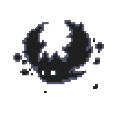
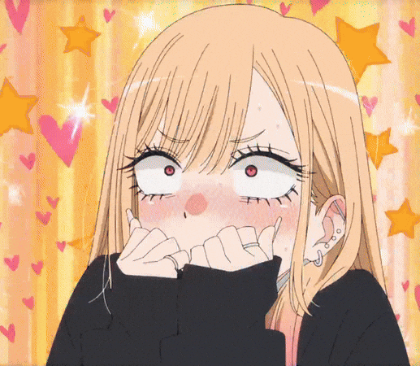
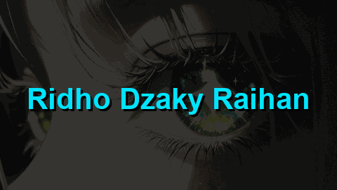
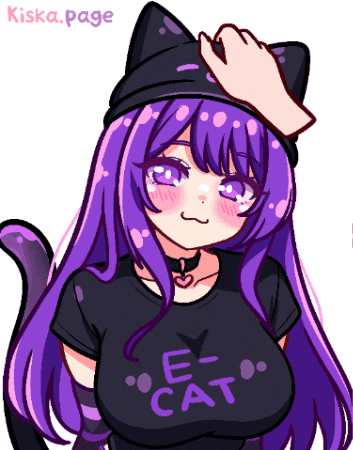

<div align="center">


<a href="https://github.com/Ridzkyan">
  
</a>

<br/>


&ensp;

&ensp;

&ensp;


<br/>

&ensp;
&ensp;


</div>

<br/>

<!-- ══════════════════════════════════════════════ -->
<!--                   ABOUT ME                   -->
<!-- ══════════════════════════════════════════════ -->

<table width="100%">
<tr>
<td width="55%" valign="top">

### ⚡ // ABOUT.ME

```ts
const ridzkyan = {
  name    : "Ridho Dzaky Raihan",
  alias   : "Ridzkyan",
  status  : "Mahasiswa 🎓",
  base    : "Indonesia 🇮🇩",

  stack: {
    frontend : ["React", "Next.js", "TypeScript"],
    backend  : ["Node.js", "Go", "Python", "PHP"],
    mobile   : ["Flutter", "Dart"],
    database : ["MySQL"],
  },

  currentFocus : "Jadi developer yang bisa ngoding",
  funFact      : "Enggan ngoding... tapi selalu kelar 🤫",
  philosophy   : "Berjalan pelan tidak masalah,
                  yang penting tidak berhenti ✨",
};
```

<div align="left">
&ensp;

</div>

<br/>

<div align="center">

</div>

</td>
<td width="45%" align="center" valign="middle">


<br/><br/>


</td>
</tr>
</table>

<br/>


<br/>

<!-- ══════════════════════════════════════════════ -->
<!--                  TECH STACK                  -->
<!-- ══════════════════════════════════════════════ -->

<table width="100%">
<tr>
<td width="50%" valign="top" align="center">

### ⚡ // TECH.STACK

**🌐 Frontend & Framework**


<br/><br/>

**⚙️ Backend & Language**


</td>
<td width="50%" valign="top" align="center">

<br/>

**📱 Mobile & Database**


<br/><br/>

**🔧 Tools & Platform**


</td>
</tr>
<tr>
<td align="center" valign="bottom">
<br/>

</td>
<td align="center" valign="bottom">
<br/>

</td>
</tr>
</table>

<br/>

<!-- ══════════════════════════════════════════════ -->
<!--               GITHUB STATS                   -->
<!-- ══════════════════════════════════════════════ -->

<div align="center">

### 📡 // GITHUB.STATS

<!-- Trophy -->


<br/><br/>

<!-- Activity Graph -->


<br/><br/>

<!-- Streak + Top Languages -->
<table width="100%">
<tr>
<td align="center" width="50%">

</td>
<td align="center" width="50%">

</td>
</tr>
</table>

</div>

<br/>

<!-- ══════════════════════════════════════════════ -->
<!--              ANIME BANNER ROW                -->
<!-- ══════════════════════════════════════════════ -->

<table width="100%">
<tr>
<td width="50%" align="center">

</td>
<td width="50%" align="center">

</td>
</tr>
</table>

<br/>

<!-- ══════════════════════════════════════════════ -->
<!--           CONTRIBUTION SNAKE                 -->
<!-- ══════════════════════════════════════════════ -->

<div align="center">

### 🐍 // CONTRIBUTION.GRID

<picture>
  <source media="(prefers-color-scheme: dark)" srcset="https://raw.githubusercontent.com/Ridzkyan/Ridzkyan/output/github-contribution-grid-snake-dark.svg">
  <source media="(prefers-color-scheme: light)" srcset="https://raw.githubusercontent.com/Ridzkyan/Ridzkyan/output/github-contribution-grid-snake.svg">
  
</picture>

</div>

<br/>


<br/>

<!-- ══════════════════════════════════════════════ -->
<!--                   QUOTES                     -->
<!-- ══════════════════════════════════════════════ -->

<table width="100%">
<tr>
<td width="55%" valign="top">

### 💬 // KATA.BIJAK

| 🌟 Tokoh | ✨ Kata-Kata |
|:---|:---|
| **Itadori Yuji** | *"Aku tidak akan menyesal — apapun pilihanku, aku jalani sampai akhir."* |
| **Levi Ackerman** | *"Kalau kamu tidak mau menyesal, pikirkan matang-matang setiap langkahmu."* |
| **Gojo Satoru** | *"Aku sudah lahir terkuat. Itu sudah lebih dari cukup."* |
| **Naruto Uzumaki** | *"Aku tidak akan lari, karena itulah jalan ninjaku!"* |
| **Sung Jin-Woo** | *"Aku tidak takut mati — aku takut tidak menjadi lebih kuat."* |

<br/>

> 💡 *"Programmer terbaik bukan yang paling pintar,*
> *tapi yang paling tahan banting saat error."*
> — **Ridzkyan** 🧑‍💻

<br/>

<div align="left">
&ensp;
&ensp;

</div>

<br/>

<div align="center">

</div>

</td>
<td width="45%" align="center" valign="middle">


<br/><br/>



</td>
</tr>
</table>

<br/>

<!-- ══════════════════════════════════════════════ -->
<!--           MID BANNER g3 + g5                 -->
<!-- ══════════════════════════════════════════════ -->

<table width="100%">
<tr>
<td width="50%" align="center" valign="bottom">

</td>
<td width="50%" align="center" valign="bottom">

</td>
</tr>
</table>

<br/>

<!-- ══════════════════════════════════════════════ -->
<!--                  CONNECT                     -->
<!-- ══════════════════════════════════════════════ -->

<div align="center">

### 🔗 // CONNECT.ME

[](https://github.com/Ridzkyan)
&nbsp;&nbsp;
[](mailto:your-email@gmail.com)

<br/>

&ensp;
&ensp;


<br/>

```
╔══════════════════════════════════════════════════════════╗
║   ✦ Terima kasih sudah mampir ke profil ini! ✦          ║
║   Kalau suka, jangan lupa kasih ⭐ di repo favoritmu~   ║
╚══════════════════════════════════════════════════════════╝
```


</div>
